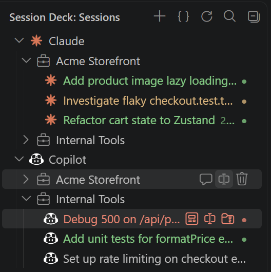
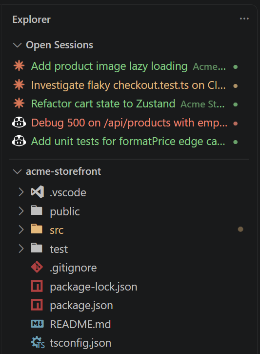
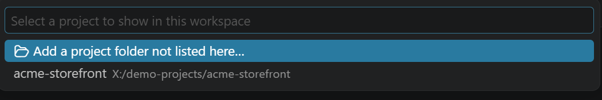
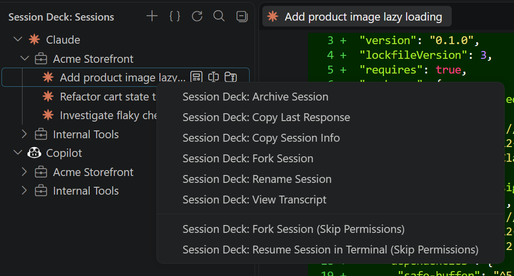

<p align="center">
  
</p>

<h1 align="center">Session Deck</h1>

<p align="center"><strong>One sidebar for every Claude Code and GitHub Copilot CLI session, across all your projects.</strong></p>

<p align="center">
  
  
</p>

Session Deck turns `~/.claude/projects` and the Copilot CLI's own session history into a curated,
per-workspace session explorer. Pick up any past session — or start a new one — in a real
terminal, running the real CLI, with live status at a glance.

<p align="center">
  
</p>
<p align="center"><em>The Session Deck tree in the Activity Bar — Claude and Copilot sessions grouped by project, with live status dots.</em></p>

<p align="center">
  
</p>
<p align="center"><em>The "Open Sessions" panel in the built-in Explorer sidebar — a flat, cross-project list of your currently open sessions.</em></p>

## Features

- **One sidebar, every project** — curated via `.vscode/session-deck.json`, not a dump of every
  session you've ever run. Add exactly the projects you want to see.
- **Claude Code + GitHub Copilot CLI, side by side** — one tree for both agents; collapses to a
  flat list automatically when you're only using one.
- **Resume in a real terminal** — the actual `claude`/`copilot` CLI, not an embedded chat panel.
  One terminal per session, reused when you click it again.
- **Live status, zero setup** — running / waiting / done / error, for both agents, with nothing to
  enable or configure. Done and error are one-time notifications: the dot clears as soon as you
  select the session, the same way a notification badge clears once you've seen it.
- **Desktop notifications** the moment a session needs your input.
- **Fuzzy search** across every session's full content, ranked by match quality.
- **Fork a session** (Claude Code) — branch a new session off an existing one's full history
  without touching the original.
- **Start brand-new sessions** for any project, right from the tree.
- **Sessions auto-archive**, they don't vanish — nothing is ever lost once a project's active list
  fills up.
- **Rename, hide, or remove** projects and sessions; per-project overrides for emoji, color,
  session cap, and permission prompts.
- **View a transcript**, or copy a session's last response or full details to the clipboard.
- **Multi-root workspace support.**
- **Open Sessions view in Explorer** — a flat, cross-project list of your currently open sessions
  with live status, right in the built-in Explorer sidebar.
- Works natively on Windows, macOS, and Linux — no WSL, no tmux.

## Requirements

- [Claude Code CLI](https://code.claude.com) and/or [GitHub Copilot CLI](https://github.com/github/copilot-cli), installed and on your `PATH`. Session Deck launches the real CLI — it doesn't reimplement either one.
- VS Code 1.93 or newer.

## Getting Started

1. Open a project folder (or a multi-root workspace) in VS Code.
2. Open the **Session Deck** icon in the Activity Bar.
3. Click **+ Add Project** and pick a project — either one Session Deck already found from your
   Claude Code or Copilot CLI session history, or any folder you browse to.
4. Click any session to resume it in a terminal, or hover a project for **+ New Session**.

<p align="center">
  
</p>
<p align="center"><em>The "Add Project" QuickPick — pick from projects Session Deck already found, or browse to any folder.</em></p>

## Configuration

### `.vscode/session-deck.json`

The sole source of truth for what shows in the tree. Created and edited for you by **Add
Project**/**Edit Project List**, or hand-edit it directly:

```jsonc
{
  "projects": [
    { "root": "C:/Source/my-project", "name": "My Project" },
    { "root": "C:/Source/side-project", "name": "Side Project", "emoji": "🚀", "maxSessionsShown": 10 }
  ]
}
```

| Field | Type | Description |
|---|---|---|
| `root` | `string` | The project's resolved git root (required). |
| `name` | `string` | Display name in the tree. Defaults to the folder name. |
| `emoji` | `string` | A literal emoji prefixed onto the project's label. |
| `color` | `string` | A named color swatch prefixed onto the label instead (ignored if `emoji` is set). |
| `maxSessionsShown` | `number` | How many active sessions show before the rest auto-archive. Default `5`. |
| `dangerouslySkipPermissions` | `boolean` | Skip the "Skip Permissions" confirmation dialog for this project specifically. |
| `hidden` | `boolean` | Keep the entry in the file but leave it out of the tree. |

In a multi-root workspace, each folder can have its own `session-deck.json` — the tree shows the
union of all of them.

### Settings

| Setting | Default | Description |
|---|---|---|
| `sessionDeck.confirmDangerousSkipPermissions` | `true` | Show a confirmation dialog before resuming or starting a session with elevated (skip-permissions) mode. |

<p align="center">
  
</p>
<p align="center"><em>A session row's right-click context menu — the full set of session actions.</em></p>

## Known Limitations

- Forking a session works for Claude Code only — Copilot CLI has no equivalent capability yet. Worth revisiting once Copilot CLI adds its own fork/branch support, the way Claude Code's `--fork-session` already works.

## Development

```bash
npm install
npm run compile   # or: npm run watch
```

Press `F5` to launch an Extension Development Host. `npm test` runs the unit test suite; `npm run
lint` runs ESLint.

## Credits

Built on ideas from:

- **[Claude Sessions Explorer](https://github.com/ShahadIshraq/claude-session-vs-code-extension)** — reading Claude Code's local session storage and driving the real CLI.
- **[agent-deck](https://github.com/asheshgoplani/agent-deck)** — the "mission control" list-of-sessions UX.
