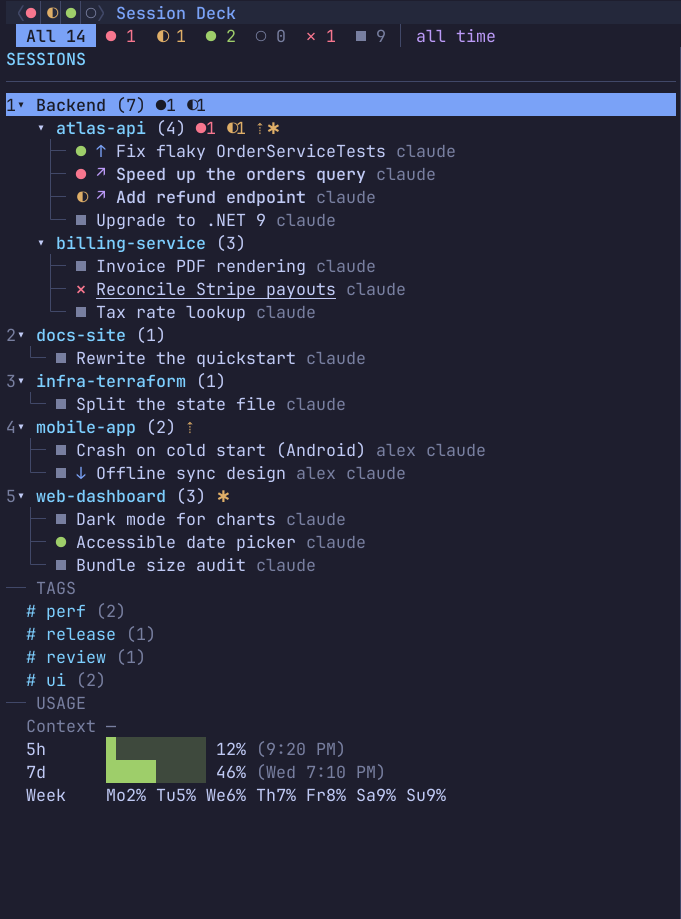
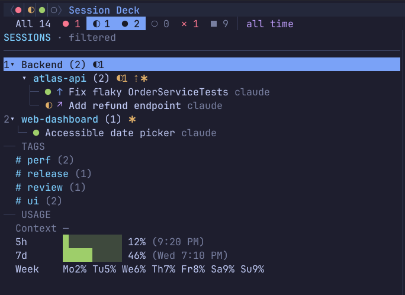
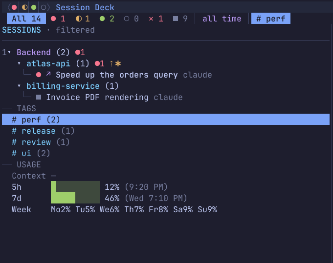
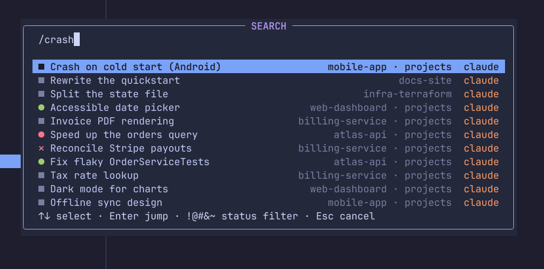

<p align="center"></p>

<h1 align="center">Session Deck</h1>

**One terminal window for all your Claude Code and GitHub Copilot CLI sessions.**



`sdeck` keeps every agent session running in the background, shows what each one is doing, and lets you
jump in and out of any of them. It runs natively on Windows: no tmux, no WSL.

Running five agents across three repositories means five terminals and constant "which one was waiting
for me?". Session Deck answers that at a glance:

- Sessions are grouped by project (by git root, so worktrees land together) and by folder.
- A status dot on every session: running, waiting for you, finished, error, stopped.
- Attach to a session full-screen, detach with `Ctrl+Q`, and it keeps working.
- Session Deck lists and resumes every past session, from all your logged-in Claude accounts.

[Install](#install) · [Quick start](#quick-start) · [Features](#features) · [Configuration](#configuration) · [User manual](docs/user-manual.md) · [Development](#development)

## Install

PowerShell (Windows):

```powershell
irm https://github.com/adrianogpena/session-deck/releases/latest/download/sdeck-installer.ps1 | iex
```

[npm](https://www.npmjs.com/package/sdeck):

```bash
npm install -g sdeck
```

Or build from source:

1. Install Rust with [rustup](https://rustup.rs) (the stable toolchain). On Windows it also needs the
   MSVC C++ build tools, which the rustup installer offers to set up.
2. Clone the repository and build it:

   ```bash
   git clone https://github.com/adrianogpena/session-deck.git
   cd session-deck
   cargo build --release
   ```

3. The binary is `target/release/sdeck.exe`. Run it directly, or copy it to a folder on your PATH.
   To install it into Cargo's bin folder instead (already on your PATH after installing Rust):

   ```bash
   cargo install --path crates/sdeck
   ```

Run `sdeck` from a terminal that supports full-screen apps (Windows Terminal, PowerShell, the VS Code terminal). It needs `claude`
and/or `copilot` on your PATH, or set their location in the [config](#configuration).

## Quick start

```bash
sdeck
```

| Key | What it does |
|---|---|
| `↑` `↓` / `j` `k` | Move through folders, projects and sessions |
| `Enter` | Attach to the selected session (a stopped one is resumed first) |
| `Ctrl+Q` | Detach; the session keeps running |
| `n` / `N` | Start a new Claude / Copilot session in the selected project |
| `i` | Interact: type into the session while the list stays visible |
| `/` | Search the prompts and replies of every session |
| `?` | Show every key |

## Features

### See what needs you



Every session shows its state, and the header and terminal title count the ones that need you, so you
see a waiting agent from the taskbar. Windows notifications fire when a session starts waiting, finishes
or fails. Filter by status (`!` running, `@` waiting, `#` idle, `&` error, `~` stopped) or by age.

| Symbol | Status |
|---|---|
| `●` blue | Running |
| `◐` yellow | Waiting for you (a permission, a choice) |
| `✓` green | Finished, not seen yet |
| `○` | Idle |
| `✕` red | Error (for example "run /login") |
| `■` | Stopped; resume it any time |

### Live preview and background sessions

The right-hand panel is the live screen of the selected session. Sessions run in background PTYs, so you
can attach, detach and switch without interrupting the agent. `s` starts a session without attaching, `i` types
into it from the list, `R` restarts it on the same conversation.

### Organize freely

- **Projects** come from git roots; branch and sync state show as one badge per project
  (`⇡` ahead, `⇣` behind, `✱` uncommitted).
- **Folders** group projects (`g`, `M`), and `K`/`J` reorder anything.
- **Tags** (`L`) group sessions across projects, with a `TAGS` section to filter by them.
- **Pin, archive, rename** sessions; deleted ones go to a trash you can restore for 30 days.
- **Multi-select** with `Space` to stop, archive, tag or move a batch.



### Find anything

`/` searches the full text of every session, not just titles. The command palette, the skills and agents
browser (`w`) and the in-app settings editor (`C`) have their own keys.



### Several accounts, two agents

Sessions from every logged-in Claude account (`~/.claude`, `~/.claude-work`, ...) are listed together,
and a resumed session reopens under the account it belongs to. GitHub Copilot CLI sessions sit beside
the Claude ones.

### Light and dark

`T` cycles dark, light and system (Tokyo Night colors). The layout adapts: panels side by side from 80
columns, stacked from 50.

## Configuration

Settings live in `~/.session-deck/config.json`; press `C` to edit them in the app.

```jsonc
{
  "ui": { "notifications": true, "gitStatus": true, "recentSessionsFirst": true },
  "tools": {
    "claude": { "command": "claude-nightly", "args": ["--model", "opus"] },
    "copilot": { "enabled": false }
  }
}
```

Every setting is described in the [user manual](docs/user-manual.md#4-global-config-sessiondeckconfigjson).
Names, pins, tags, folders and order are stored in `~/.session-deck/state.json`.

## Development

```bash
cargo test --workspace
cargo clippy --workspace --all-targets -- -D warnings
cargo fmt --all --check
```

- `crates/sdeck-core`: discovery, status, the shared state store. No terminal dependencies.
- `crates/sdeck`: the TUI binary.
- `crates/fake-agent`: test-only stand-in for `claude`.
- `crates/sdeck-demo`: a sandbox with fake projects and sessions (below).

### Try it with fake data

```bash
cargo build --release -p sdeck -p sdeck-demo
target/release/sdeck-demo        # sandbox in target/demo, then starts sdeck inside it
```

`sdeck-demo` writes six git repositories, fourteen sessions across two Claude accounts, tags, a folder
and usage meters under `target/demo`. The meters cover context, the 5h and 7d quotas, and daily spend.
It points `sdeck` at that sandbox, so your real sessions and settings are never touched.
A few sessions are already running or waiting; press `Enter` on any other to start it under a scripted
stand-in agent. Use it for screenshots and for trying the UI.

## License

MIT. See [LICENSE](LICENSE).
